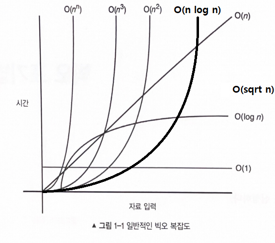

# 자바스크립트 알고리즘

## 목차

- [1장. 빅오 표기법](#1장-빅오-표기법)
- [2장. 자바스크립트 특징](#2장-자바스크립트-특징)
- [3장. 자바스크립트 숫자](#3장-자바스크립트-숫자)
- [4장. 자바스크립트 문자열](#4장-자바스크립트-문자열)
- [5장. 자바스크립트 배열](#5장-자바스크립트-배열)
- [7장. 자바스크립트 메모리 관리](#7장-자바스크립트-메모리-관리)
- [8장. 자바스크립트 재귀](#8장-재귀)
- [9장. 자바스크립트 집합](#9장-집합)
- [부록. 추가 정리](#추가-정리)

## 1장. 빅오 표기법

[./Chapter1(Big-O%20Notation).js 예제](<./Chapter1(Big-O%20Notation).js>)

> 빅오 표기법은 알고리즘의 최악의 경우 복잡도를 측정한다.  
> 빅오 표기법에서 n은 입력의 개수를 나타낸다.



O(1) : 상수 시간 (ex) `for(let i=0; i < 1000; i++)`  
O(log n) : 로그 시간 (ex) `for(let i=0; i < n; i * 2)`  
O(n) : 선형 시간  
O(n^2) : 2차 시간  
O(n^3) : 3차 시간  
O(n^n) : n차 시간  
O(∞) : 무한 루프 (ex) `while(true)`

### 빅오 표기법 규칙

- 계수 법칙 : 입력 크기와 연관되지 않는 상수 무시 => 계수/상수 제거
- 합의 법칙 : 동일한 블록 레벨의 시간복잡도를 더할 수 있다. => 빅오 더하기
- 곱의 법칙 : 중첩된 블록의 시간복잡도를 곱할 수 있다. => 빅오 곱하기
- 다항 법칙 : f(n)이 k차 다항식이면 f(n) = O(n^k) => 루프를 조사해 빅오 표기법의 다항 결정
- 전이 법칙

(ex) 숫자와 관계 없이 n번 더한 후 1번 더하면 n + 1 | 시간 복잡도 : O(n)  
(ex) 반복문이 5\*n 까지면 f(n) = 5n, n까지면 f(n) = n | 시간 복잡도 : O(n)  
(ex) f(n) = 5n^2 | 시간 복잡도 : O(n^2)

## 2장. 자바스크립트 특징

[./Chapter2(UniqueParts).js 예제](<./Chapter2(UniqueParts).js>)

> `var` : 변수를 어디서(블록 내부) 선언하든 함수의 맨 앞으로 이동한다.  
> 단, false인 조건문은 건너 뛴다.

- `typeof 연산자`를 배열에 사용해도 `object`를 반환한다.
- 기본 등가 확인 연산자인 `==`과 `===`는 문자열, 숫자, 불리언 같은 비객체형에만 사용할 수 있다. 객체에 대한 등가 확인을 구현하려면 객체의 각 속성을 확인해야 한다.

### 참/거짓

- false로 평가되는 경우 : `false`, `NaN`, `0`, `undefined`, 빈 문자열(`''`, `""`), `null`
- true로 평가되는 경우 : `true`, 비어 있지 않은 문자열, 0이 아닌 다른 숫자, 비어 있지 않은 객체

## 3장. 자바스크립트 숫자

[./Chapter3(Numbers).js 예제](<./Chapter3(Numbers).js>)

> 자바스크립트의 모든 숫자는 64비트 부동소수점 형태이다.  
> 십진분수로 인해 자바스크립트에서 부동소수점 체계가 반올림 오류를 일으킬 수 있다.

```javascript
0.1 + 0.2 === 0.3; // false
```

- 가능한 가장 작은 부동소수점 증가를 얻기 위해서는 `Number.EPSILON` 을 사용해야 한다.
- `Number.EPSILON` : 두 개의 표현 가능한 숫자 사이의 가장 작은 간격을 반환한다.

### 자바스크립트 숫자 범위

- `Number.MAX_VALUE` : 가능한 가장 큰 부동 소수점 반환
  - -> `1.7976931348623157e + 308`
- `Number.MAX_SAFE_INTEGER` : 가장 큰 정수 반환
  - => 서로 다른 소수를 더한 값은 같지 않다.
- `Number.MIN_VALUE` : 가능한 가장 작은 부동 소수점 반환
  - => 음수가 아닌 0에 가장 가까운 부동소수점
  - -> `5e - 324`
  ```javascript
  Number.MIN_VALUE - 1 == -1; // true
  ```
- `Number.MIN_SAFE_INTEGER` : 가장 작은 정수 반환
  - => 서로 다른 소수를 뺀 값은 같지 않다.
  - -> `-9007199254740991`

```
-Infinity < Number.MIN_SAFE_INTEGER < Number.MIN_VALUE < 0 < Number.MAX_SAFE_INTEGER < Number.MAX_VALUE < Infinity
```

### 숫자 알고리즘

> 가장 효율적인 규칙을 찾는 것 => 가장 좋은 알고리즘의 비결

#### 1. 소수

> 암호화와 해싱의 기반이 된다.

**[알고리즘]**

- ⓐ 2와 3을 제외한 모든 소수는 `6k ± 1`의 형태를 지닌다.
- ⓑ n의 제곱근이 소수가 아닌 정수라면 n은 소수가 아니다.
- **시간 복잡도 : O(sqrt(n))**

```javascript
function isPrime(n) {
  if (n <= 1) return false;
  if (n <= 3) return true;

  // 입력된 수가 2 또는 3인 경우 아래 반복문에서
  // 다섯 개의 숫자를 건너뛸 수 있다.
  if (n % 2 == 0 || n % 3 == 0) return false;

  for (var i = 5; i * i <= n; i = i + 6) {
    if (n % i == 0 || n % (i + 2) == 0) return false;
  }

  return true;
}
```

#### 2. 소인수분해

> 주어진 숫자를 만들기 위한 소수들의 곱

**[알고리즘]**

1. n을 2로 나눌 수 있는 만큼 나눈다. (2 출력)
2. i를 2씩 증가시키며 n을 나눌 수 있는 만큼 i로 나눈다. (i 출력)
3. n이 2보다 크다면 n을 출력한다.

- **시간 복잡도 : O(sqrt(n))**

```javascript
function primeFactors(n) {
  // n이 2로 나눠진다면 나눠질 수 있는 수만큼 2가 출력된다.
  while (n % 2 == 0) {
    console.log(2);
    n = n / 2;
  }

  // 이 지점에서 n은 홀수임이 확실하다. 따라서 수를 두 개씩 증가시킬 수 있다(주목: i = i + 2).
  for (var i = 3; i * i <= n; i = i + 2) {
    // i가 n을 나눌 수 있는 한 계속해서 i가 출력되고 n을 i로 나눈다.
    while (n % i == 0) {
      console.log(i);
      n = n / i;
    }
  }
  // 다음 조건문은 n이 2보다 큰 소수인 경우를 처리하기 위한 것이다.
  if (n > 2) {
    console.log(n);
  }
}
```

#### 3. 무작위 수 생성

> 어떤 조건이 어떤 식으로 동작하는지 확인

- `Math.random()` : 0과 1 사이의 부동소수점 반환
  - 범위 변경 : 범위에 해당하는 숫자를 연산
  - 무작위 정수 : `Math.floor()`, `Math.round()`, `Math.ceil()`

#### 4. 모듈러 제곱거듭

> 컴퓨터 과학, 공개키 암호화 알고리즘 분야에서 사용된다.

- `(x^y) % p` : x는 기저, y는 지수, p는 모듈러
- 강력한 암호의 경우 기저가 최소 256비트(78개 수)
- -> `Math.pow()`로는 32비트 부동소수점까지만 저장할 수 있어 실제로 활용하기 어렵다.

**[수학적 속성]** : 1부터 지수까지 순회하면서 현재 모듈러를 마지막 모듈러와 곱함으로써 매번 재계산 가능

```
c % m = (a b) % m
c % m = [(a % m)(b % m)] % m
```

**[의사코드]**

1. `값 = 1` 로 설정한다. 현재 지수는 0이다.
2. 현재 지수를 1만큼 증가시킨다.
3. 현재 지수가 목표 지수가 될 때까지 `값 = (값 * 기저) mod 모듈러` 로 설정한다.

- **시간 복잡도 : O(n)**

```javascript
function modularExponentiation(base, exponent, modulus) {
  if (modulus == 1) return 0;

  var value = 1;

  for (var i = 0; i < exponent; i++) {
    value = (value * base) % modulus;
  }
  return value;
}
```

## 4장. 자바스크립트 문자열

[./Chapter4(Strings).js 예제](<./Chapter4(Strings).js>)

### 문자열 함수

#### 1. 문자열 접근 : `.charAt(index)`, `.subString(startIndex[, endIndex])`

#### 2. 문자열 비교 : `>`, `<`

#### 3. 문자열 검색 : `.startsWith('문자열')`, `.endsWith('문자열')`

**indexOf(searchValue[, fromIndex])**

- 일치하는 문자열을 발견하지 못한 경우 `-1`이 반환된다
- 대소문자 구분

```javascript
// 어떤 문자열 내에 특정 문자열이 존재하는지 확인
function existsInString(stringValue, search) {
  return stringValue.indexOf(search) !== -1;
}
console.log(existsInString('red', 'r')); // prints 'true';
console.log(existsInString('red', 'b')); // prints 'false';
```

```javascript
var str = "He's my king from this day until his last day",
  count = 0,
  pos = str.indexOf('a');

// str.indexOf('a')가 while에 걸려서 문자열의 끝까지 도는 것
while (pos !== -1) {
  console.log(pos); // pos = 24 38 43
  count++;
  pos = str.indexOf('a', pos + 1);
}
console.log(count); // prints '3'
```

#### 4. 문자열 분해 : `.split(separator)`

> 하나의 매개변수(분리자)를 입력받아 부분 문자열 배열을 생성한다.

#### 5. 문자열 바꾸기 : `.replace(string, replaceString)`

> 문자열 변수 내에 특정 문자열을 다른 문자열로 대체한다.

##### 정규 표현식 : 검색 패턴을 정의한 문자열들의 집합

- **선택 매개변수 일치 관련 설정**
  - i : 대소문자를 구분하지 않고 일치하는 문자열을 검색한다.
  - g : 전역적으로 일치하는 문자열을 검색한다(일치하는 문자열을 처음 발견한 이후 멈추는 대신 모든 일치하는 문자열을 찾는다.)
  - m : 다중열 문자열에 대해서도 일치하는 문자열을 검색한다.
- **기본 객체 RegExp**
  - `문자열.search(검색문자열)` : 문자열 내에 일치하는 문자열을 찾는다. 일치하는 문자열의 인덱스를 반환한다. 일치하지 않으면 `-1` 반환
  - `문자열.match(검색문자열)` : 일치하는 문자열을 찾는다. 문자열이 일치하면 검색 문자열을 반환한다. 일치하지 않으면 `null` 반환
  - `정규표현식.exec(문자열)` : 문자열 내에 일치하는 문자열을 찾는다. 일치하는 첫 번째 문자열을 반환한다.
  - `정규표현식.test(문자열)` : 문자열 내에 일치하는 문자열을 찾는다. true 또는 false를 반환한다.
- **기본 정규 표현식**
  - `^` : 문자열/줄의 시작을 나타낸다.
  - `\d` : 모든 숫자를 찾는다.
  - `[abc]` : 괄호 내의 모든 문자를 찾는다.
  - `[^abc]` : 괄호 내의 문자들을 제외한 모든 문자를 찾는다.
  - `[0-9]` : 괄호 내의 모든 숫자를 찾는다.
  - `[^0-9]` : 괄호 내의 숫자들을 제외한 모든 문자를 찾는다.
  - `(x|y)` : x 또는 y를 찾는다.
- **자주 사용하는 정규 표현식**
  - `/\d+/` : 숫자를 포함하는 문자
  - `/^\d+$/` : 숫자만 포함하는 문자
  - `/^[0-9]*.[0-9]*[1-9]+$/` : 부동소수점 문자
  - `/[a-zA-Z0-9]/` : 숫자와 알파벳만 포함하는 문자
- **질의 문자열** : `/([^?=&]+)(=([^&]*))/`
  - 웹 애플리케이션에서 웹 URL은 대개 경로 찾기나 데이터베이스의 질의 목적의 매개변수를 포함한다.

```javascript
// SELECT LCD, TV FROM database WHERE Category = 4 AND Product_id = 2140;
var uri =
  'http://your.domain/product.aspx?category=4&product_id=2140&query=lcd+tv';
var queryString = {};
uri.replace(new RegExp('([^?=&]+)(=([^&]*))?', 'g'), function ($0, $1, $2, $3) {
  queryString[$1] = $3; // $1은 속성, $3은 값 기준
  console.log(`$0 : ${$0}`); // $0은 '?', '&' 기준
  console.log(`$2 : ${$2}`); // $2는 '=' 기준
  console.dir(`queryString : ${queryString}`);
});
console.log('ID: ' + queryString['product_id']); // ID: 2140
console.log('Name: ' + queryString['product_name']); // Name: undefined
console.log('Category: ' + queryString['category']); // Category: 4
```

### 인코딩

> 컴퓨터 과학 분야에서 효율적인 전송 혹은 저장을 위해 문자들을 특수 포맷으로 표현하는 포괄적인 개념  
> 모든 컴퓨터 파일 유형은 특정 구조로 인코딩된다.

#### Base64 인코딩

> `btoa()` : 문자열로부터 Base64 인코딩된 ASCII 문자열을 생성한다. 문자열의 각 문자는 바이트로 취급된다.  
> `atob()` : Base64 인코딩을 사용해 인코딩된 자료의 문자열을 디코딩한다.

```javascript
console.log(btoa('hello I love learning to computer program'));
console.log(atob('aGVsbG8gSSBsb3ZlIGxlYXJuaW5nIHRvIGNvbXB1dGVyIHByb2dyYW0'));
```

### 문자열 단축

Bit.ly와 같은 단축 URL을 지닌 사이트가 동작하는 방법 : 단순화된 URL 압축 알고리즘 사용

1. 데이터베이스가 URL에 대해 정수 기반 고유 ID를 생성한다.
2. 정수 ID는 인코딩되어 문자열로 단축된다.

### 암호화

> TLS : 서버와 클라이언트 간에 암호화된 연결을 수립하기 위한 표준 보안 기술

SSL 경고 메시지 - 브라우저와 서버 간에 데이터가 암호화되지 않을 수도 있음을 의미.

1. 서버는 브라우저에게 자신의 비대칭 공개 키를 전송한다.
2. 브라우저는 현재 세션을 위한 대칭 키를 생성한다. 해당 대칭 키는 서버의 비대칭 공개 키로 암호화된다.
3. 서버는 자신의 비밀 키로 브라우저의 세션을 복호화해 세션 키를 추출한다.
4. 이제 두 시스템 모두 세션 키를 가지고 있어 세션 키를 사용해 자료를 안전하게 전송한다.

#### RSA - 가장 널리 사용되는 공개 키 암호화 알고리즘

> RSA : 큰 정수의 인수분해 난이도에 기반한 암호화 알고리즘

- 두 개의 큰 소수와 보조 값이 공개 키로 생성된다.
- 누구나 메시지를 암호화하기 위해 공개 키를 사용할 수 있지만 소인수를 지닌 사람만이 메시지를 해독할 수 있다.

1. 키 생성 : 공개 키와 비밀 키가 생성된다. 생성된 키 생성 방법 역시 비밀이어야 한다.
2. 암호화 : 공개 키를 통해 비밀 메시지를 암호화할 수 있다.
3. 복호화 : 비밀 키로만 암호화된 메시지를 복호화할 수 있다.

##### RSA 알고리즘

1. 두 개의 소수 p와 q를 선택한다. 대개 큰 소수를 선택한다.

- p와 q의 곱을 n이라고 표기한다.
- `(p-1)`과 `(q-1)`의 곱을 phi라고 표기한다.

2. 두 개의 지수 e와 d를 선택한다.

- e는 일반적으로 3이다. 2보다 큰 다른 값을 사용할 수 있다.
- d는 `(e * d) % phi = 1`인 값이다.

## 5장. 자바스크립트 배열

[./Chapter5(Arrays).js 예제](<./Chapter5(Arrays).js>)

### 1. 삽입 : 새로운 항목을 배열 내에 추가하는 것

> `.push(element)` : 새로운 항목을 배열 끝에 추가한다. **[시간 복잡도 : O(1)]**

### 2. 삭제 : 배열 내 항목을 제거하는 것

> `.pop()` : 배열 내 마지막 항목을 제거한다. 제거한 항목을 반환한다. **[시간 복잡도 : O(1)]**

> `.shift()` : 배열 내 첫 번째 항목을 제거한다. 제거한 항목을 반환한다. **[시간 복잡도 : O(n)]** n : 배열의 길이

- 배열의 모든 요소를 앞으로 이동시켜야 하므로, 배열의 길이에 비례한 시간이 소요됩니다.
- 따라서 배열이 매우 큰 경우에는 shift()를 사용하는 것이 성능에 부정적인 영향을 미칠 수 있으므로 주의해야 합니다.
- 만약 배열의 첫 번째 요소를 제거하는 동작을 빈번하게 수행해야 한다면, 대안적인 자료 구조를 고려하거나 배열의 요소 순서를 역전시키는 것이 더 효율적일 수 있습니다.

### 3. 접근 : 특정 인덱스의 배열에 접근하는 것

> `배열명[index]` : 인덱스를 사용해 메모리의 주소로부터 직접 값을 얻는다. **[시간 복잡도 : O(1)]**

### 4. 반복 : 어떤 자료 구조 내에 담긴 항목들을 하나씩 접근하는 것

> `for(변수; 조건; 수정)` : n번을 실행한다. **[시간 복잡도 : O(n)]**

> `while(조건)` : n번을 실행한다. **[시간 복잡도 : O(n)]**

> `for(key in 객체)` : 객체의 속성을 열거하기 위한 것으로 주로 객체를 순회하는 데 사용됩니다. **[시간 복잡도 : O(n)]** n : 객체의 속성 수

> `for(값 of 배열 및 순회가능한객체)` : 반복 가능한(iterable) 객체를 순회하기 위한 것으로 주로 배열이나 문자열과 같은 순회 가능한 객체의 요소를 순회할 때 사용됩니다. **[시간 복잡도 : O(n)]** n : 반복 가능한 객체의 요소 수

> `forEach()` : 배열을 순회하면서 각 요소에 대해 콜백 함수를 실행합니다. **[시간 복잡도 : O(n)]** n : 배열의 요소 수

- 반복 바깥으로 빠져나오거나 배열 내 특정 항목들을 건너뛸 수 없다.
- 각 항목을 반복 접근한다는 의미에 있어 좀 더 명시적이다.

### 5. 도움 함수 : 배열 처리에 자주 사용되는 함수

> `.slice(begin, end)` : 기존 배열을 수정하지 않고 해당 배열의 일부를 반환한다. **[시간 복잡도 : O(n)]** n : 추출하려는 요소의 개수

- 매개변수가 없는 경우 : 배열의 복사본 반환(메모리 주소 다름)
  - 자바스크립트의 배열은 참조기반이다.
- 매개변수가 1개 있는 경우 : 매개변수 값에 해당하는 인덱스부터 끝 인덱스까지 배열의 일부를 반환한다.
- 매개변수가 2개 있는 경우 : begin 인덱스부터 end - 1 인덱스까지 배열의 일부를 반환한다.
- slice함수의 범위가 배열을 초과한다면 배열의 끝까지 반환한다.
- 시작 인덱스를 음수로 하면 배열을 역순으로 접근하여 반환한다.

> `.from()` : 이터러블 객체나 유사 배열 객체를 기반으로 새로운 배열을 생성합니다. **[시간 복잡도 : O(n)]** n : 이터러블 객체의 요소 수

> `splice(시작 인덱스, 제거할 항목의 크기, 추가할 신규 항목1, 추가할 신규 항목2)` : 기존 항목을 제거하거나 신규 항목을 추가함으로써 배열의 내용을 반환하고 변경한다. **[시간 복잡도 : O(n)]** n : 추출하려는 요소의 개수

> `concat()` : 첫 번째 배열의 모든 요소를 새로운 배열에 복사한 다음, 두 번째 배열의 모든 요소를 새로운 배열에 추가합니다. **[시간 복잡도 : O(m + n)]** m : 첫 번째 배열의 길이, n : 두 번째 배열의 길이

> `.length` 속성 : 배열의 크기를 반환한다. 해당 속성을 더 작은 크기로 변경하면 배열에서 항목들이 제거된다. **[시간 복잡도 : O(1)]**

- 무엇이든 배열의 길이를 검색하는 작업은 배열의 크기와 무관하게 매우 빠르게 실행됩니다.

> 전개 연산자(Spread Operator) : `...` 세 개의 점으로 표현되며, 배열이나 객체 안의 요소를 개별적으로 추출하거나 확장하는 데 사용됩니다. **[시간 복잡도 : O(n)]** n : 전개 연산자가 작용하는 배열 또는 객체 내의 요소 수

- 함수나 배열, 객체를 조작할 때 유용하며, 제로 인자가 필요한 상황에서 사용될 수 있습니다.

> `.apply()` : `전개 연산자(...)`와 거의 동일하게 동작한다.
> `functionName.apply(thisArg, [arg1, arg2, ...]);`

- `functionName`: `apply()` 메서드를 호출할 함수
- `thisArg`: 함수가 실행될 때 사용할 this 값.
- `[arg1, arg2, ...]`: 함수에 전달할 인자를 배열 형태로 나열한 것.

#### `.apply()` 주요 특징과 용도

1. 동적 함수 호출: `apply()`를 사용하면 함수를 동적으로 호출할 수 있습니다. 함수의 이름이나 인자의 개수를 런타임에 결정할 수 있습니다.
2. `this` 값 설정: `apply()`를 사용하여 함수 내에서 `this` 값을 지정할 수 있습니다. 이것은 객체 지향 프로그래밍에서 메서드 호출과 관련이 있습니다.
3. 배열을 함수의 인자로 전달: 배열을 사용하여 함수에 여러 인자를 전달할 수 있으며, 함수 내에서 이를 처리할 수 있습니다.

## 7장. 자바스크립트 메모리 관리

[./Chapter7(MemoryManagement).js 설명](<./Chapter7(MemoryManagement).js>)

## 8장. 재귀

[./Chapter8(Recursion).js 예제](<./Chapter8(Recursion).js>)

> 재귀는 기저 조건과 분할 정복 방식으로 구성된다.

- 기저(종료) 조건: 재귀 메소드는 자기 자신을 호출하기 때문에 기저 조건에 도달하지 않으면 계속 자기 자신을 호출한다. 재귀로 인한 스택 오버플로는 올바른 기저 조건을 갖추지 못한 결과일 가능성이 매우 높다. 기저 조건에서는 더 이상 재귀함수 호출을 하지 않는다.
- 분할 정복 방식: 어떤 문제를 작은 단위로 나눠서 해당 작은 단위의 문제들을 모두 해결함으로써 문제를 해결하는 것을 말한다.

  - 분할 정복에 의해 점점 작아지면서 기저 조건에 도달해야 한다.

- 재귀 알고리즘의 빅오 분석은 마스터 정리를 통해 수행된다.
  - 점화식: `T(n) = aT(n/b) + O(n^c)`, 조건: `a >= 1, b >= 1`
    - `a: 재귀 호출에 곱해지는 계수`, `b: 재귀 호출 시에 n을 나누는 로그항`, `c: 등식의 비재귀 구성 요소에 대한 다항식의 항`
  - 해당 경우가 마스터 정리의 3가지 중 어디에 속하는지 결정하기 위해 a와 b, c를 식별해야 한다.
    - 첫 번째 경우: `c < logb(a)`이면 `O(n^(logb(a)))`이다.
    - 두 번째 경우: `c < logb(a)`이면 `T(n) = O(n^c log(n))`이다.
    - 세 번째 경우: `c > logb(a)`이면 `T(n) = O(f(n))`이다.
- 재귀 알고리즘을 구현할 때 재귀함수 호출의 콜 스택으로 인한 추가적인 메모리를 고려해야 한다. 각 재귀 호출은 실행 시간에 콜 스택에서의 공간을 필요로 한다. 콜 스택이 n 호출만큼 축적된 경우 해당 함수의 공간 복잡도는 `O(n)`이다.

## 9장. 집합

[./Chapter9(Sets).js 설명](<./Chapter9(Sets).js>)

- 집합의 구현은 해시 테이블의 구현을 기초로 한다.
- `Set` 객체는 `size` 속성 하나만이 존재한다.

## 추가 정리

### 배열 복사 성능 비교 `.slice()`, `.from()`, `전개 연산자`

어떤 방법을 선택해야 하는지는 사용 사례와 성능 상황에 따라 다를 수 있습니다.  
대부분의 경우에서는 차이가 미미하며 코드의 가독성과 목적을 고려해야 합니다.  
그러나 만약 배열 복사가 성능에 중요한 역할을 하는 경우, `slice()` 메서드가 다른 방법보다 약간 더 빠를 수 있습니다.  
최적의 선택은 실제 성능 테스트를 통해 판단해야 합니다.

## 가정

for 조건 왼쪽 제곱 : sqrt
for 변경 곱하기 : log
while % : log

```javascript
/*
i * i -> sqrt
n -> n
i = i * 2 -> log
*/
for(let i = 0; i * i < n; i = i * 2)

while(number % divisor == 0) // log
```
